## 项目简介
FridaRpcTool 是一款基于 BurpSuite Java API 开发的辅助型插件，该插件主要用于**对 App 请求/响应数据包中的字段进行便捷加密/解密操作**，从而辅助安全从业人员进行安全检测。

随着时间的推移，软件和系统的安全措施越来越先进，Web 端漏洞的挖掘难度也在不断上升。如果你希望能对目标资产进行更全面的安全检测，就需要不断尝试寻找新的突破口或攻击面进行测试。Android App 就是一个很好的例子，但是当代 App 一般都会对请求中的关键字段进行**加密或签名**保护，一定程度上阻碍了我们的安全检测工作。

这个时候通常有 2 种解决方法：

1. 对 App 进行逆向分析，在 Java 层或 so 层中寻找加密/解密代码，随后还原协议

   - 优点：稳定高效

   - 缺点：不同 App 逆向分析难度不同，顺利的情况下 App 使用标准算法，可直接通过 Hook 得到 Key、iv 等关键值。不顺利的情况下 App 可能会使用魔改算法，并将加密逻辑存放在 so 层，随后再加上 OLLVM、VMP 等保护，分析测试难度成倍上涨

2. RPC 算法转发

   - 优点：简单便捷，不必关注算法本身的细节

   - 缺点：由于使用算法转发，导致流量会多走一层，因此在高并发的情况下效率会受到影响

## 项目特点

该插件选择的解决方法为第 2 种，通过 **Frida RPC 算法转发**来解决安全检测过程中加密或签名保护的问题。该方法简单便捷，同时插件提供了**模式选择、域名过滤、自动 URL 解码、JSON 数据解析等实用功能**，帮助安全从业者提高安全检测效率。

## 免责声明

**该项目仅用于安全学习以及合法的渗透测试。请勿使用于任何非法用途，由此产生的后果自行承担。**

## 使用方法

### 插件安装

BurpSuite Extender 标签 -> Extensions -> Burp Extensions -> Add -> Select file ... -> Next

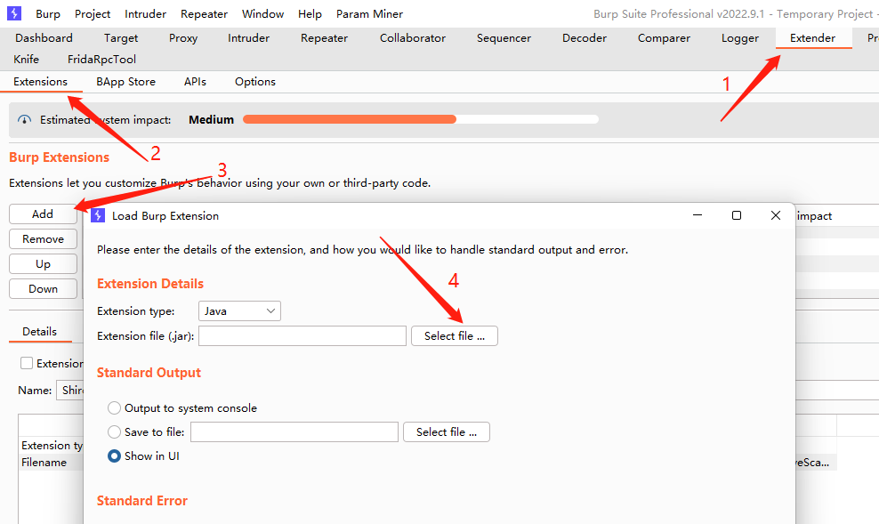

提示以下信息表示插件安装成功

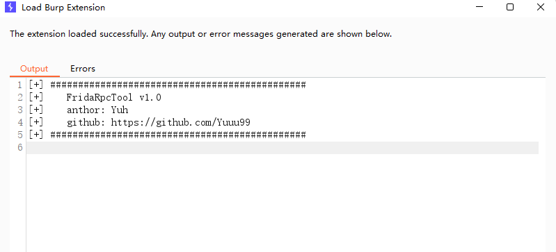

### 功能介绍

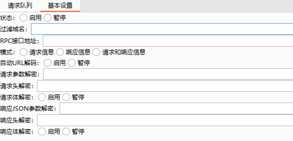

1. 状态

启用插件/暂停插件

2. 过滤域名

可在此处指定一个域名，指定域名后所有流经 BurpSuite 的流量都会在请求队列标签下单独展示，防止测试过程中检测人员被其他流量所干扰

3. RPC 接口地址

可在此处指定一个 RPC 的接口地址，项目默认的 Python 脚本接口地址为 http://127.0.0.1:8088/post，可在 Python 中自行修改

4. 模式

可在此处指定加密字段出现的位置

5. 自动 URL 解码

选择启用后会将密文先进行一次 URL 解码，随后再通过 RPC 算法转发到解密函数

**注意**：此处的 URL 解码是全局的，例如在请求中你需要同时解密请求头以及请求参数，那么请求头密文和请求参数密文都会先进行一次 URL 解码。而有时会遇到请求头密文未被 URL 编码，请求参数密文被 URL 编码的情况，如果此时你同时选择了请求头、请求参数解密，那么未被 URL 编码的数据解密可能会出现问题。

6. 请求参数解密

可在此处指定 GET、POST 请求中需要解密的参数，此处不可与请求体解密同时使用，且该功能优先级高于请求体解密

7. 请求头解密

可在此处指定需要解密的请求头

8. 请求体解密

选择启用则将请求体信息进行解密，此处不可与请求参数解密同时使用，且该功能优先级低于请求参数解密

9. 响应 JSON 参数解密

可在此处指定响应 JSON 数据中需要解密的键，支持递归解析，此处不可与响应体解密同时使用，且该功能优先级高于响应体解密

10. 响应头解密

可在此处指定需要解密的响应头

11. 响应体解密

选择启用则将响应体信息进行解密，此处不可与响应 JSON 参数解密同时使用，且该功能优先级低于响应 JSON 参数解密

## 使用示例

1. 在 Java.perform 处填写加密/解密算法的 Frida Hook 代码，其中 item_mode 表示模式，item_data 表示需要加密/解密的数据，data 表示加密/解密运算后的返回数据

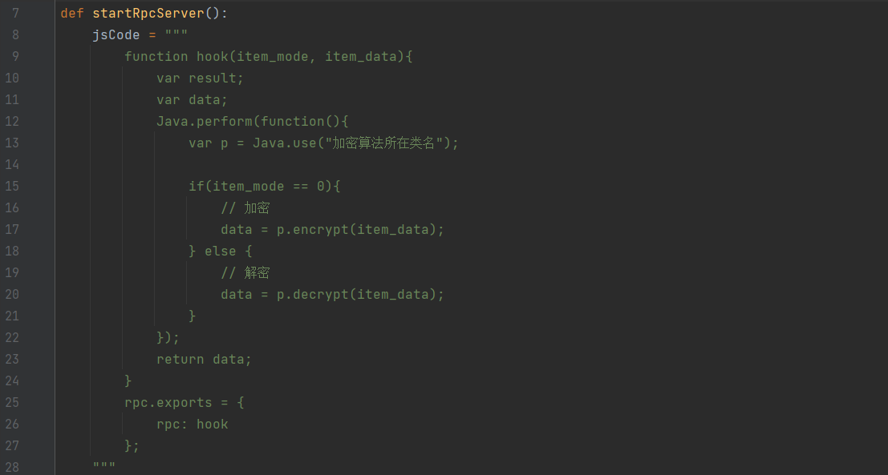

2. 指定 App 包名

```python
process = frida.get_usb_device().attach("App 包名")
```

3. 启动 RPC 服务（src/main/java/com/yuh/burp/python/rpc.py）

```python
if __name__ == '__main__':
    startRpcServer()
```

如需修改端口（默认 8088）可修改此处：

```python
uvicorn.run(app, port=8088)
```

如需修改接口地址（默认 /post）可修改此处：

```python
@app.post("/post")
```

启动成功后终端输出如下所示

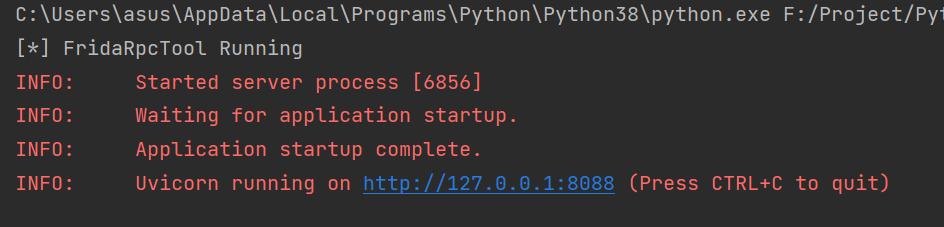

4. 在 Proxy HTTP history 标签中解密请求头

请求头内容为加密信息

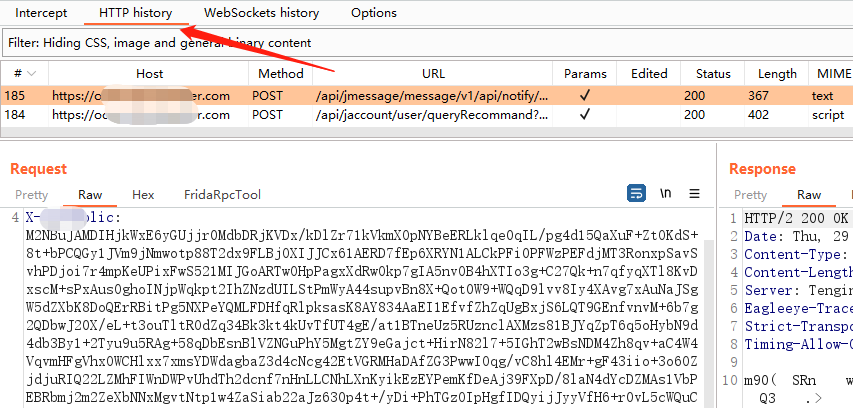

在 BurpSuite FridaRpcTool 插件中填入相应信息

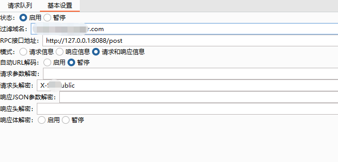

切换到 FridaPpcTool 标签，发现数据成功解密

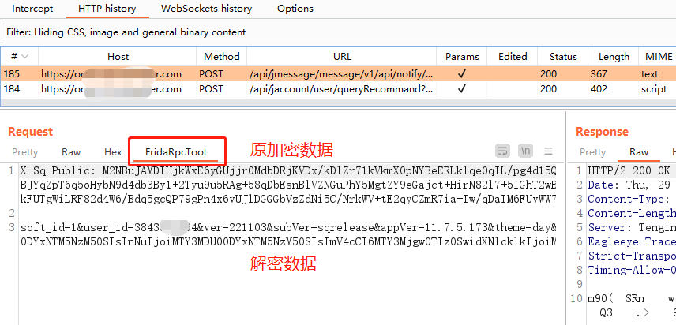

5. 在 Proxy HTTP history 标签中解密请求参数，并自动对数据进行 URL 解码

请求参数内容为加密信息，同时密文被 URL 编码

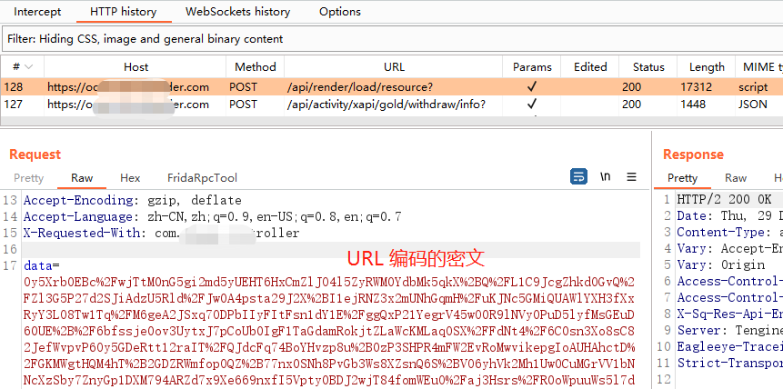

在 BurpSuite FridaRpcTool 插件中填入相应信息

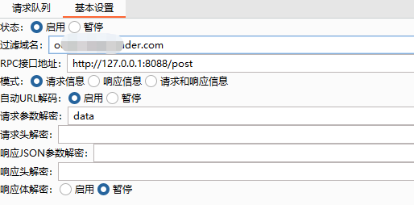

切换到 FridaPpcTool 标签，发现数据成功解密

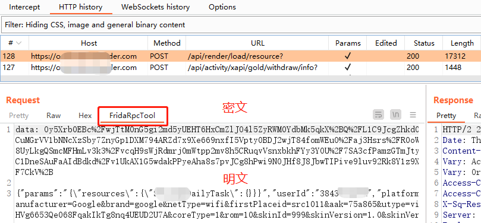

6. 在 Proxy HTTP history 标签中解密响应体数据

响应体内容为加密信息

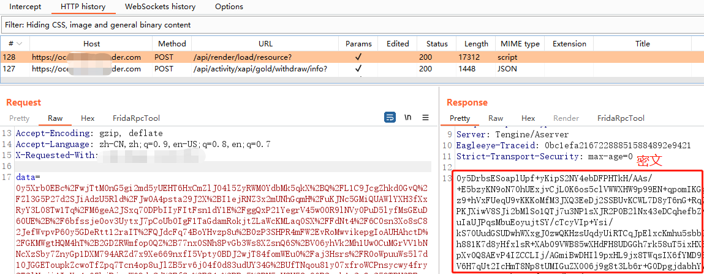

在 BurpSuite FridaRpcTool 插件中填入相应信息

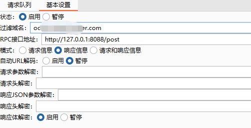

切换到 FridaPpcTool 标签，发现数据成功解密

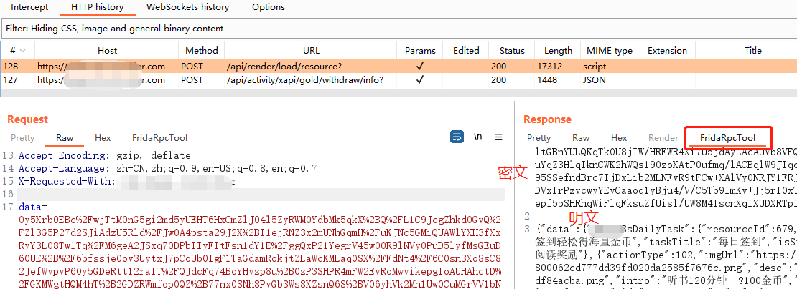

7. 在 Repeater 标签中解密请求参数，修改后再加密参数发送

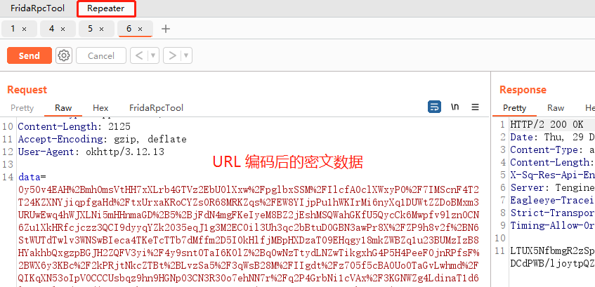

在基本设置中启用自动 URL 解码，随后选择加密的数据，鼠标右键选择 FridaRpcTool 标签下的 Decrypt Data

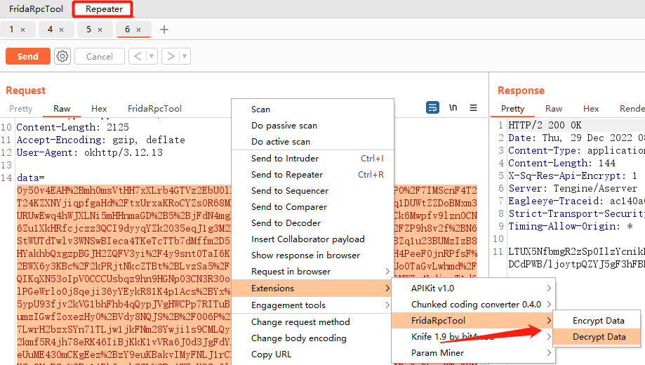

加密数据解密成功

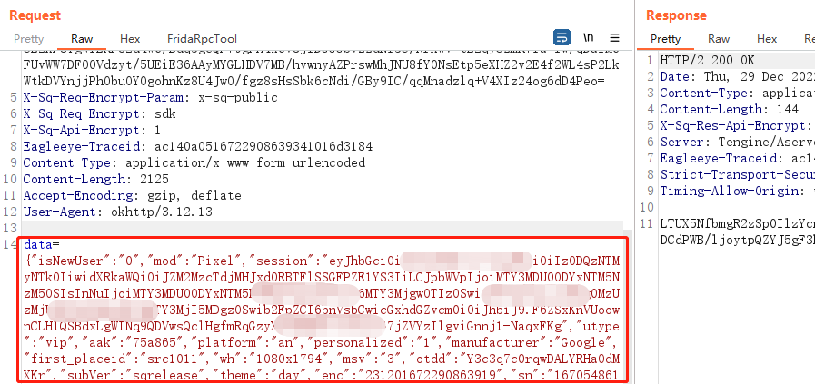

修改数据包内容后，再通过 FridaRpcTool 标签下的 Encrypt Data 将明文信息加密，并发送到服务器端

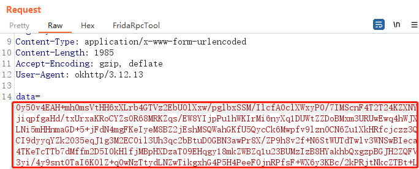

8. 过滤域名效果展示

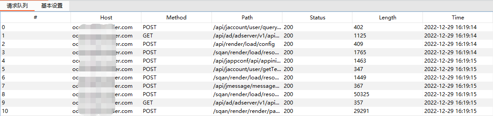

9. 如果出现加解密操作时而成功，时而不成功的情况，多半问题出现在网络问题，此时重启服务（Python 代码）即可解决
